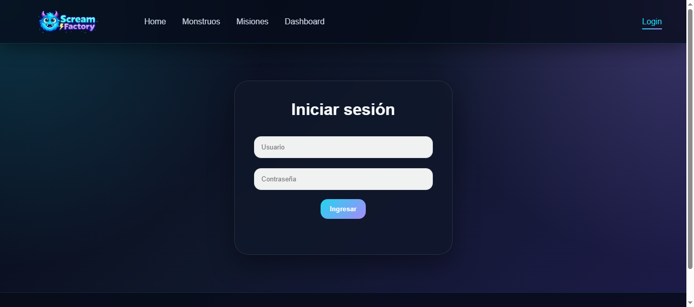
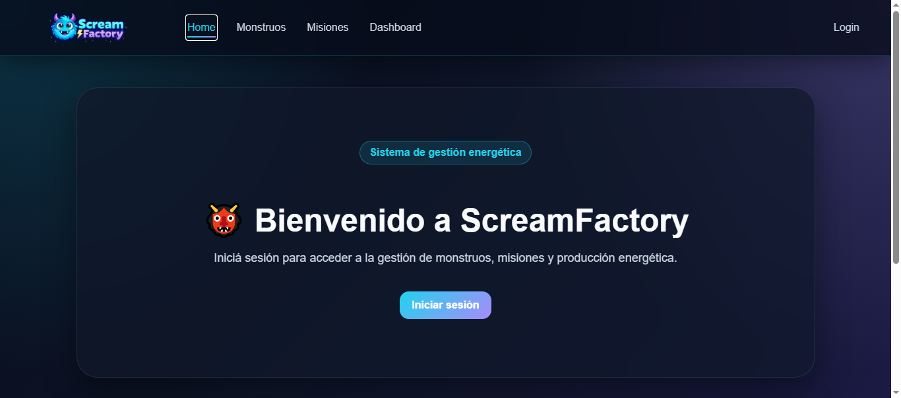
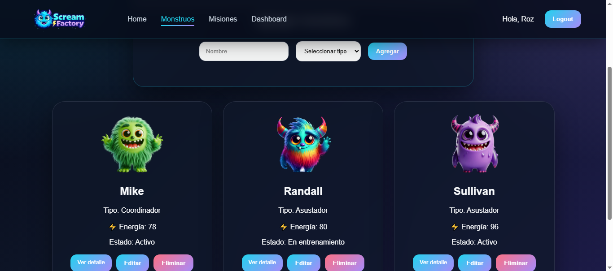
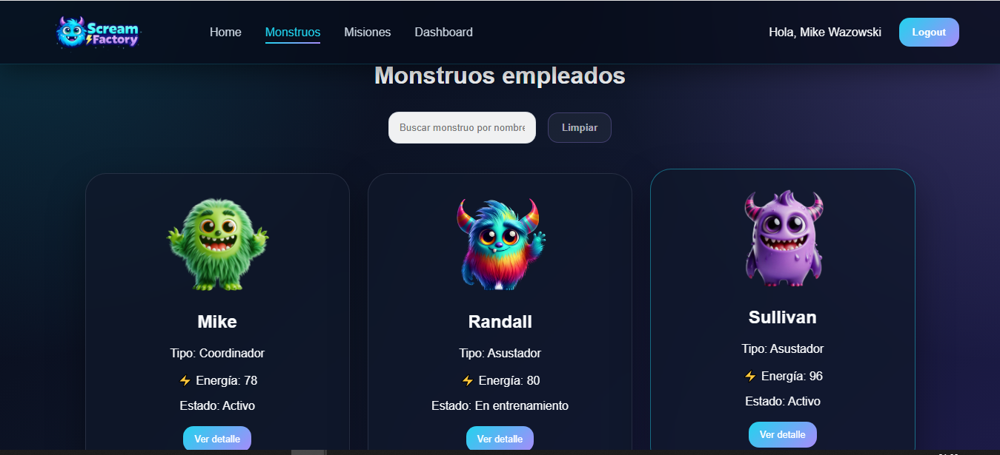
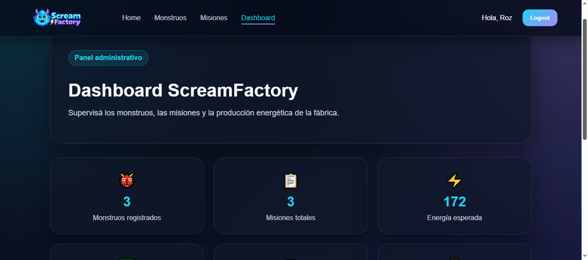
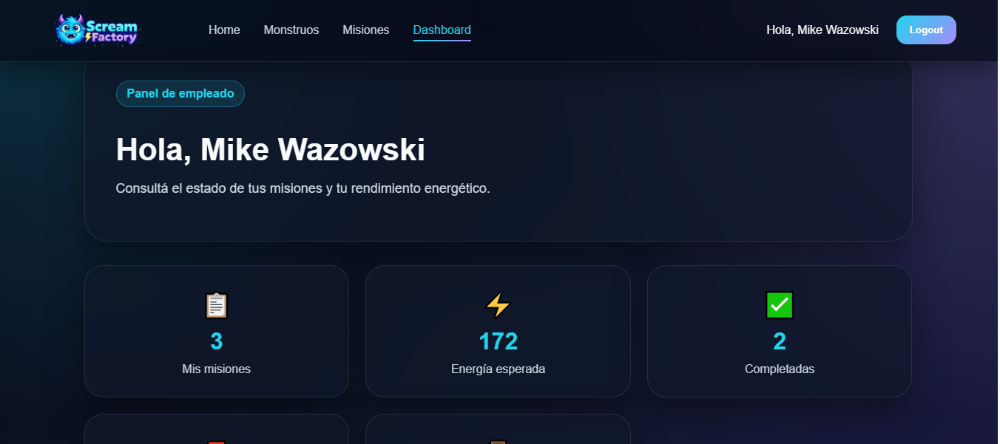
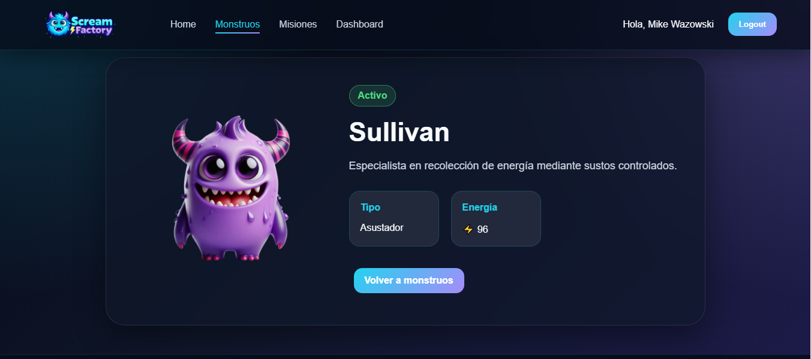
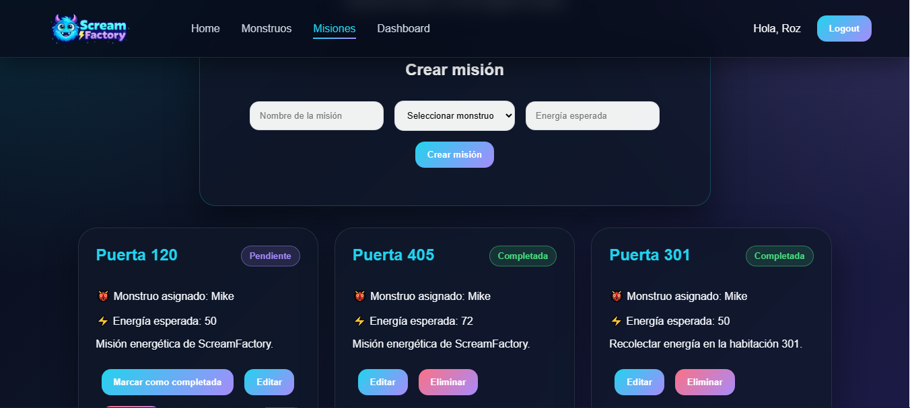
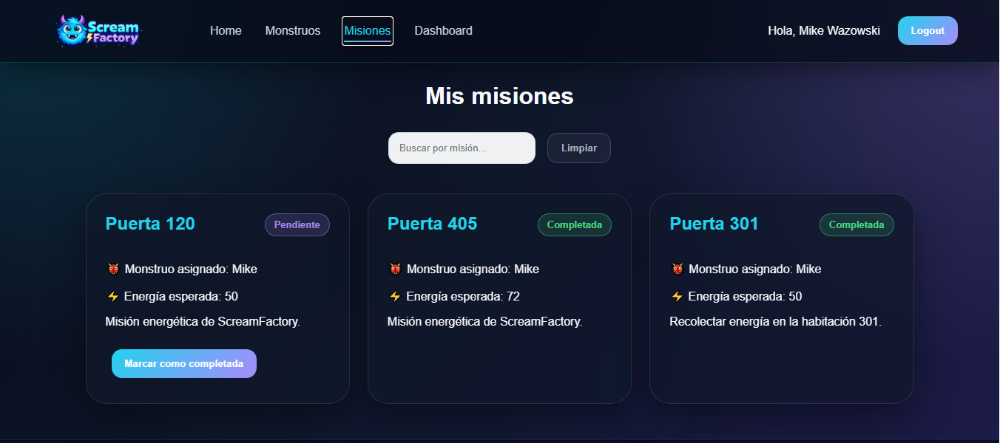
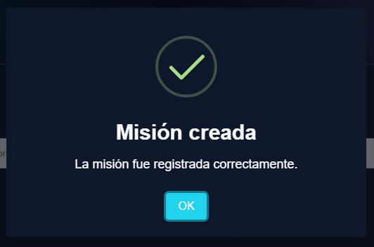

# Alumna:

- **Nombre:** Eliana Bermúdez
- **Carrera:** Analista de Sistemas
- **Materia:** Plataformas de Desarrollo
- **Cuatrimestre:** 4° Cuatrimestre
- **Año:** 2026

---

# Descripción del proyecto ScreamFactory

Trabajo Final - Plataformas de Desarrollo

ScreamFactory es una aplicación web Full Stack que permite administrar monstruos empleados y gestionar las misiones energéticas asignadas a cada uno. El sistema implementa autenticación mediante JWT y control de acceso por roles, diferenciando las funcionalidades disponibles para administradores y empleados

---

# Tecnologías utilizadas

## Frontend

- React
- React Router DOM
- Context API
- Fetch API
- SweetAlert2
- CSS3
- Vite

## Backend

- Node.js
- Express
- MongoDB
- Mongoose
- JWT (JsonWebToken)
- bcrypt
- dotenv

---

# Arquitectura

La aplicación sigue una arquitectura cliente-servidor

Frontend:
- React
- Consumo de API REST mediante Fetch API
- Context API para autenticación

Backend:
- Express
- Controladores
- Modelos Mongoose
- Middleware
- API REST

Base de datos:
- MongoDB

---
# Estructura del proyecto

```
screamfactory/
│
├── backend/
│   ├── config/
│   ├── controllers/
│   ├── middleware/
│   ├── models/
│   ├── routes/
│   ├── scripts/
│   ├── utils/
│   ├── .env
│   ├── package.json
│   ├── package-lock.json
│   └── server.js
│
├── frontend/
│   ├── public/
│   ├── src/
│   │   ├── assets/
│   │   ├── components/
│   │   ├── context/
│   │   ├── pages/
│   │   ├── routes/
│   │   ├── services/
│   │   ├── styles/
│   │   ├── App.jsx│   │   
│   │   └── main.jsx
│   ├── .env
│   ├── .env.example
│   ├── .oxlintrc.json
│   ├── .gitignore
│   ├── index.html
│   ├── package.json
│   ├── package-lock.json
│   └── vite.config.js
├── screenshots
└── README.md

```
---

# Roles del sistema

## Administrador

Puede:

- Crear monstruos
- Editar monstruos
- Eliminar monstruos
- Crear misiones
- Editar misiones
- Eliminar misiones
- Consultar dashboard completo

---

## Empleado

Puede:

- Consultar monstruos
- Buscar monstruos por nombre
- Consultar detalle de cada monstruo
- Visualizar las misiones asignadas
- Marcar sus misiones como completadas

No puede modificar información administrativa

---

# Funcionalidades

## Autenticación

- Login con JWT
- Persistencia de sesión mediante LocalStorage
- Protección de rutas privadas
- Logout

---

## Monstruos

- Alta
- Edición
- Eliminación
- Listado
- Detalle
- Búsqueda por nombre

---

## Misiones

- Alta
- Edición
- Eliminación
- Consulta
- Cambio de estado
- Visualización según rol

---

## Dashboard

Panel administrativo con:

- Total de monstruos
- Total de misiones
- Energía acumulada
- Ranking del monstruo con mayor energía

---

# Base de datos

MongoDB almacena:

- Usuarios
- Monstruos
- Misiones

Las relaciones se implementan mediante referencias de Mongoose

---
# Variables de entorno

## Backend (.env)

```env
PORT=3000
MONGO_URI=mongodb+srv://<usuario>:<password>@cluster.mongodb.net/screamfactory
JWT_SECRET=tu_clave_jwt
```

## Frontend (.env)

```env
VITE_API_URL=http://localhost:3000/api
```

# Seguridad

El sistema implementa:

- Autenticación mediante JWT
- Middleware de autenticación
- Middleware de autorización por roles
- Encriptación de contraseñas con bcrypt
- Persistencia de sesión mediante LocalStorage
- Validaciones en frontend y backend

---

# Instalación

## Backend

```bash
cd backend
npm install
npm run dev
```

Servidor:

```
http://localhost:3000
```

---

## Frontend

```bash
cd frontend
npm install
npm run dev
```

Aplicación:

```
http://localhost:5173
```

---

# Usuarios de prueba

## Administrador

Usuario:

```
roz
```

Contraseña:

```
1234
```

---

## Empleado

Usuario:

```
mike
```

Contraseña:

```
4321
```

---

# Capturas

- Login
    
- Home 
    
- Gestión de monstruos admin 
    
- Consulta de monstruos emp
         
- Dashboard admin 
    
- Dashboard empl
        
- Detalle del monstruo
    
- Gestión de misiones admin
      
- Consulta de misiones emp
      
- SweetAlert
        

---

## Enlaces

Repositorio GitHub

https://github.com/

Frontend publicado

https://

Backend publicado

https://

